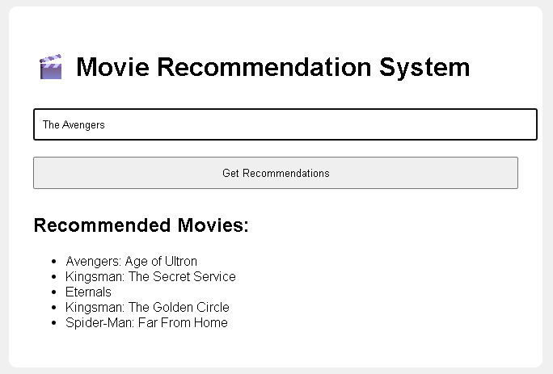

# 🎬 Movie Recommendation System

A simple yet effective **Movie Recommendation System** built with **Python**, **Flask**, and **scikit-learn**. It suggests similar movies based on the description (overview) of a selected movie using **Content-Based Filtering** and **TF-IDF Vectorization**.

---

## 🚀 Features

- 🔍 Search for a movie title
- 🧠 Recommends top 5 similar movies based on content
- 📦 Lightweight and easy to run locally
- 🌐 Simple web interface using Flask

---

## 🛠 Technologies Used

- Python 3.x
- Flask
- Pandas
- Scikit-learn
- HTML/CSS

---

## 📥 Dataset

This project uses a simplified version of the [TMDB 5000 Movie Dataset](https://www.kaggle.com/datasets/tmdb/tmdb-movie-metadata). Your `movies.csv` should have at least the following columns:

```csv
id,title,overview
1,Toy Story,A story of a boy and his toys that come to life.
2,Jumanji,A board game that comes to life.
...
```

## 🔧 Installation

### 1. Clone the Repository
```bash
git clone https://github.com/sujit-codezen/movie_recommendation_system.git
cd movie-recommender
```

### 2. Create Virtual Environment (optional but recommended)
```bash
python -m venv venv
source venv/bin/activate  # On Windows: venv\Scripts\activate
```

### 3. Install Dependencies
```bash
pip install -r requirements.txt
```

### 4. Run the App
```bash
python app.py
```

## DEMO

